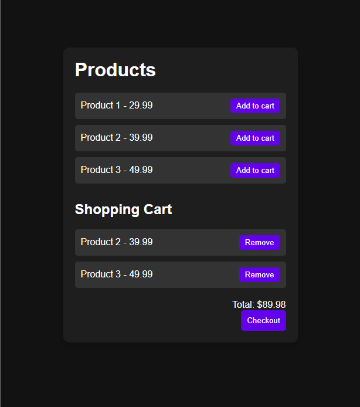

# 🛒 Simple E-Commerce Cart

A very basic e-commerce shopping cart built with **HTML, CSS, and JavaScript**.  
This project demonstrates how to add products, store them in **localStorage**, and manage a **cart system** with add/remove and checkout functionality.  

---

## 🚀 Features
- Product listing with "Add to Cart" buttons.
- Cart system powered by **localStorage** (persists after page reload).
- Add and remove items dynamically.
- Live **total price calculation**.
- Checkout option that clears the cart.
- Simple, lightweight, and dependency-free.

---

## 📸 Screenshots

---

## 🖼️ Demo
👉 **Hosted URL:** [Your Live Project Link Here](https://rajdipchatterjee.github.io/ecommerce-01/)  

---

## 📂 Project Structure
